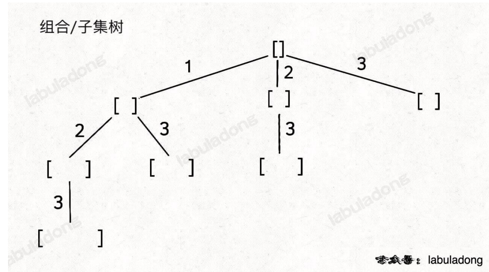
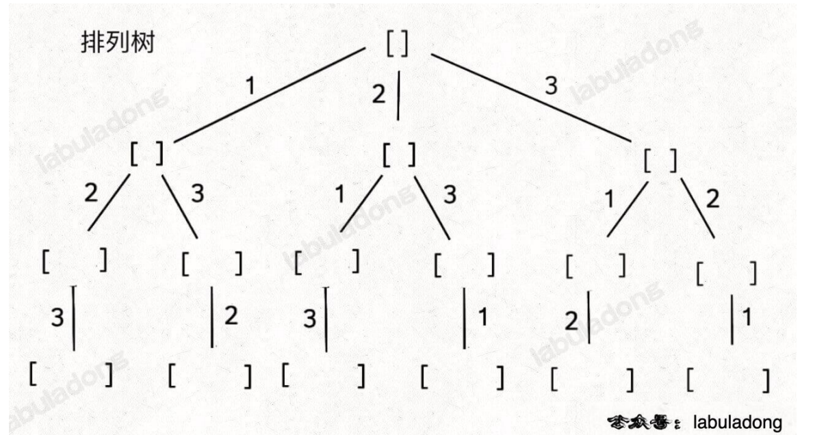

基础框架



```typescript
const solution = (nums: number[]) => {
    const res = [];
    const arr = [];
    const backtrack = (start: number) => {
        res.push([...arr]);
        for (let i = start; i < nums.length; i++) {
            arr.push(nums[i]);
            backtrack(start + 1);
            arr.pop();
        }
    };
    backtrack(0);
    return res;
};
```

nums 中的元素可以重复用, backtrack(start + 1) 改为 backtrack(start)

组合或子集中的元素个数控制为 k, res.push([...arr]) 加个判断 arr.length === k

组合或子集问题去掉重复解, 比如[1, 1, 2]的子集[1, 2] 有两个可能,需要去掉. 把 nums 排序, 在 arr.push 之前加上判断 i > start && nums[i] === nums[i - 1], 如果是排列,则判断为 i > start && nums[i] === nums[i - 1] && !visited[i - 1] 用来维持相等元素的相对位置有序, 相等元素只能按序选择
